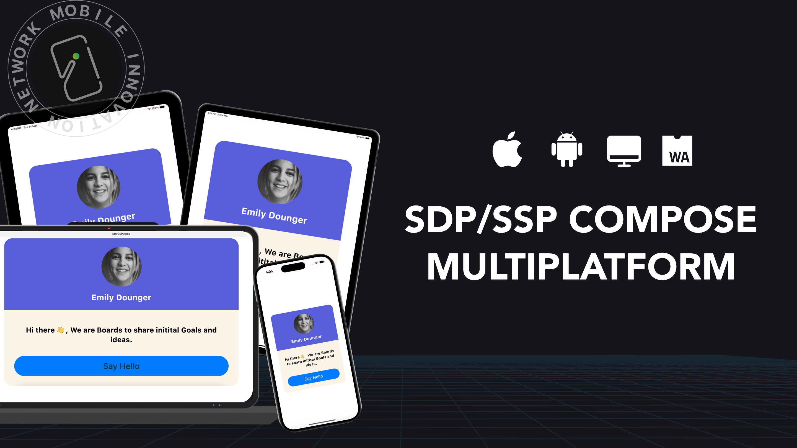
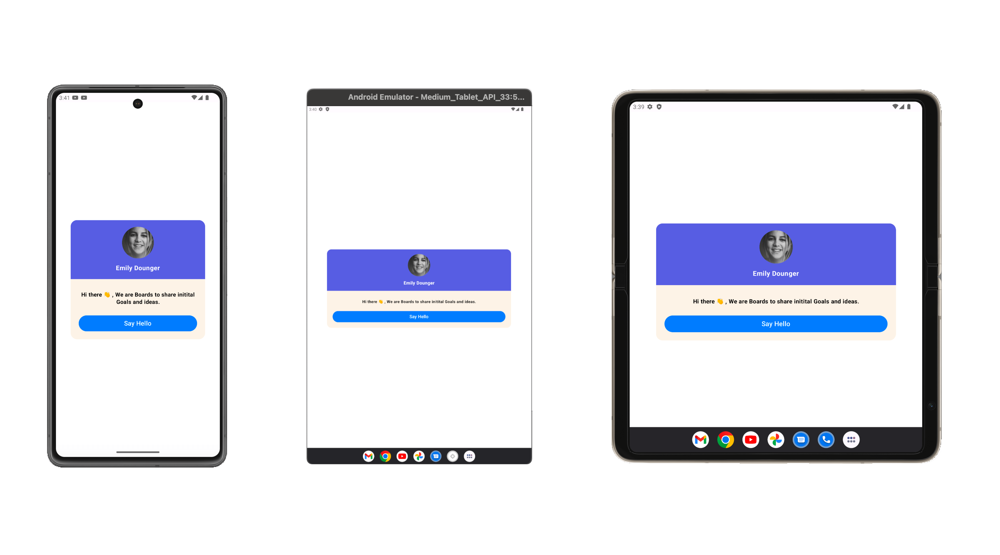
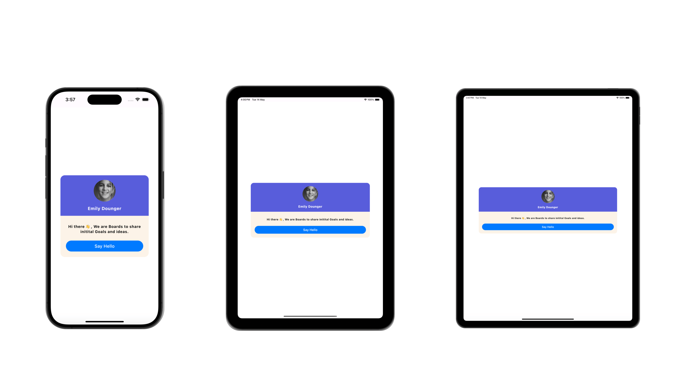
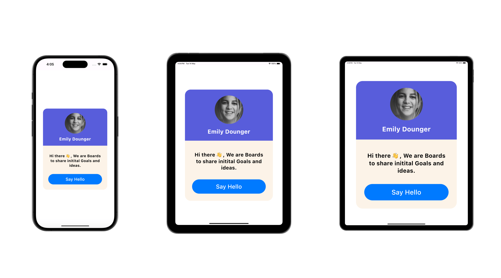

# SDP-SSP-Compose-Multiplatform
[](https://central.sonatype.com/artifact/network.chaintech/sdp-ssp-compose-multiplatform)
[](http://kotlinlang.org)
[](https://github.com/JetBrains/compose-multiplatform)


**SDP-SSP-Compose-Multiplatform** is a scalable size unit library designed specifically for Compose Multiplatform projects. It enables consistent UI scaling across iOS, Android, Desktop, and WebAssembly (Wasm), ensuring a seamless user experience on different screen sizes and resolutions.

This library eliminates the traditional reliance on fixed dp (density-independent pixels) and sp (scale-independent pixels) by introducing sdp (scalable dp) and ssp (scalable sp) units. These units dynamically adjust based on screen density, making layouts more adaptive and ensuring better usability across platforms.



## 🚀 Key Features

**Compose Multiplatform Support:** Works across Android, iOS, Desktop, and WebAssembly (Wasm).

**Adaptive UI Scaling:** Uses sdp and ssp to automatically adjust sizes based on screen density.

**Easy to Integrate:** Simple API that seamlessly integrates with existing Jetpack Compose projects.

**Consistent Layouts:** Ensures UI consistency across multiple screen sizes and platforms.

**No Additional Setup Required:** Works out-of-the-box without complex configurations.

## 📦 Installation

Add the dependency to your `build.gradle.kts` file:

```
commonMain.dependencies {
    implementation("network.chaintech:sdp-ssp-compose-multiplatform:1.0.6")
}
```
## ⚙️ Customizing the Scaling Ratio
By default, the library uses a scaling ratio of 300 for .sdp and .ssp values. You can change this to fit your design needs using:
```kotlin
SDPConfig.setScalingRatio(250.0) // Set a custom ratio

```

## 🎨 Usage
Use **sdp** and **ssp** for adaptive and scalable UI components:
```kotlin
val padding = 16.sdp
val fontSize = 14.ssp

Box(modifier = Modifier.padding(padding)) {
    Text(text = "Hello, World!", fontSize = fontSize)
}
```
This ensures a consistent and adaptive layout across all supported platforms.

## 📱 Platform-Specific Comparisons

### Android
- Layout built using **dp & sp**


- Layout built using **sdp & ssp**


### iOS
- Layout built using **dp & sp**


- Layout built using **sdp & ssp**


### Desktop
- Layout bulit using **sdp & ssp**


### WasmJs
- Layout bulit using **sdp & ssp**
  

## 📚 Additional Resources
[Demo Implementation](https://github.com/ChainTechNetwork/sdp-ssp-compose-multiplatform/blob/main/composeApp/src/commonMain/kotlin/network/chaintech/sdpcomposemultiplatformdemo/App.kt) - Check out the demo class to see the library in action.

[](https://medium.com/mobile-innovation-network/sdp-ssp-compose-multiplatform-99ad7969c146)

[](https://www.linkedin.com/showcase/mobile-innovation-network)

## 🌟 If you find this library useful, consider starring ⭐ the repository to show your support!

